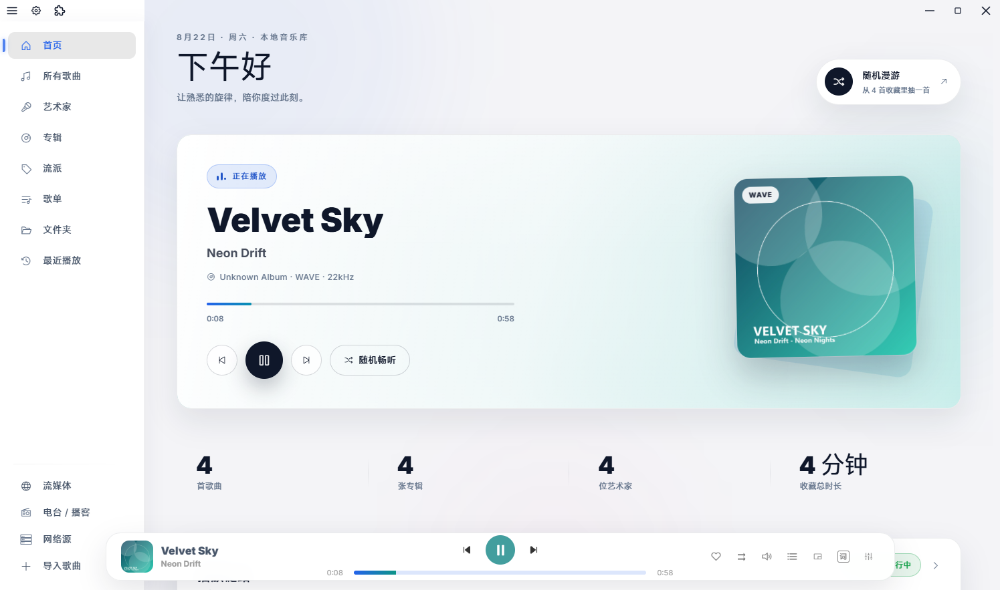
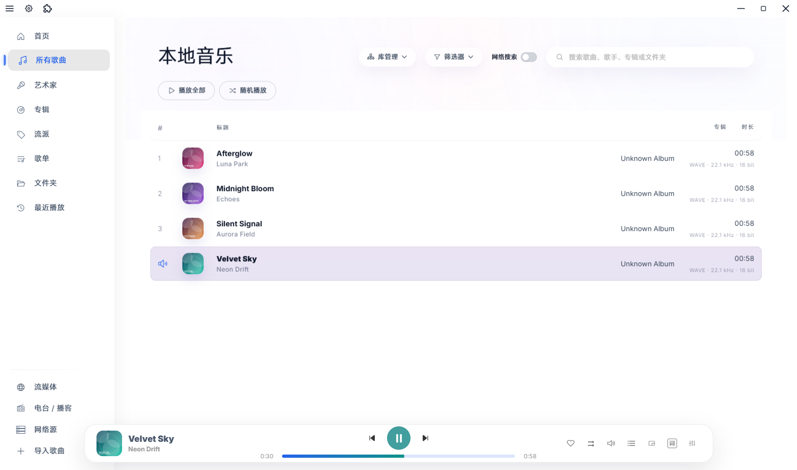
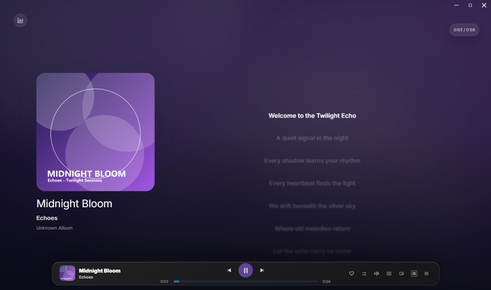
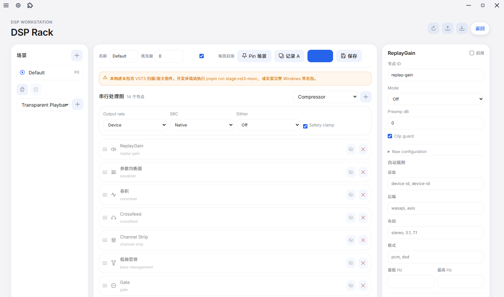

# Twilight Echo

<p align="center">
  
</p>

<p align="center">
  一款面向本地音乐收藏、在线音乐发现与 HiFi 播放的现代桌面音乐播放器。
</p>

<p align="center">
  <a href="https://github.com/Bad0RANG3/Twilight_Echo">
    
  </a>
  
  
  <a href="./LICENSE">
    
  </a>
</p>

<p align="center">
  <a href="#截图预览">截图预览</a>
  ·
  <a href="#功能一览">功能一览</a>
  ·
  <a href="#支持的音频格式">格式支持</a>
  ·
  <a href="#安装与运行">安装与运行</a>
  ·
  <a href="#原生音频引擎">原生音频引擎</a>
</p>

> 当前源码版本为 `1.1.0-preview.0`，以 Windows 10/11 为主要目标平台；macOS 与 Linux 后端仍在持续完善。

## 项目简介

Twilight Echo 希望把散落在硬盘、歌单和不同音乐服务里的音乐，放回同一套清晰、流畅的聆听体验中。

- 本地模式适合管理大型本地音乐库：递归扫描、增量更新、虚拟化列表、元数据补全、封面和歌词管理。
- 在线模式通过内置网易云音乐 provider 与扩展中心接入每日推荐、歌单、搜索、私人 FM、电台/播客等内容。
- 播放端使用独立 C++20 原生音频引擎，提供 FFmpeg 解码、DSP 链、均衡器、ReplayGain、WASAPI/ASIO 输出、DSD/SACD 与 VST3 等能力。
- 界面提供沉浸式歌词、桌面歌词、迷你播放器、主题定制、播放队列、睡眠定时、桌面歌词和远程控制等完整桌面体验。

> [!NOTE]
> 当前项目的主要目标平台是 Windows 10/11。macOS CoreAudio 与 Linux ALSA 后端已有实现，但尚未经过与 Windows 同等级别的正式发布验证。

## 截图预览

> 以下主界面截图采用浅色主题；沉浸式播放页保留封面取色背景，以呈现完整播放氛围。

### 本地音乐首页



### 本地音乐库

大型列表采用虚拟化渲染，支持歌曲、艺术家、专辑、流派、文件夹、歌单、最近播放、搜索与筛选。



### 在线音乐

内置网易云音乐 provider，提供每日推荐、私人 FM、私人雷达、歌单发现、音乐库与云盘入口。


### 沉浸式歌词

逐行、逐词高亮，支持翻译歌词、封面取色与深色/浅色主题，也可以切换桌面歌词或迷你播放器。



### DSP 与输出诊断

信号链、处理模块、输入/输出格式与实际设备状态可以实时查看。



### 均衡器与耳机校正

提供图形均衡器、参数均衡器、OPRA/AutoEQ 耳机补偿和预设管理。


### 扩展中心

通过 `.tep` 安装包启用、更新或移除扩展；网易云音乐源是内置 provider，第三方音源与 UI 能力可由独立扩展提供。


### 设置页

媒体库、播放引擎、DSP、缓存、网络代理、外观、桌面歌词与快捷键均可集中配置。


## 功能一览

### 本地音乐库

- 递归扫描多个音乐文件夹，并通过路径、大小、修改时间做增量更新。
- 按歌曲、艺术家、专辑、流派、歌单、文件夹和最近播放浏览。
- 读取标签、内嵌封面、歌词；支持完整重扫、暂停、继续和取消。
- 大型歌曲列表虚拟化，支持多选、搜索、筛选、重复检测和播放会话恢复。
- 支持设置导出/导入、库重置、音乐文件夹管理和扫描状态查看。

### 在线内容与扩展

- 内置网易云音乐 provider，提供登录、每日推荐、私人 FM、私人雷达、搜索、歌单和音乐云盘。
- 扩展中心支持 `.tep` 插件安装、启用、更新、移除和开发者模式。
- 插件系统提供统一 provider、主题插件、插件 API 和离线索引。
- 还提供电台/播客、网络音乐源（WebDAV、FTP、SMB、SFTP、NFS、DLNA 等）能力。

### 原生音频与 HiFi

- C++20/CMake/Node-API 原生音频引擎，通过独立 audio service 进程隔离崩溃影响。
- FFmpeg 解码，支持常见国内/国际格式以及 DSF、DFF、SACD ISO、APE、WV、MQA（作为 FLAC 兼容容器）等。
- 输出后端：WASAPI Shared/Exclusive、ASIO；CoreAudio 与 ALSA 后端已有实现，但验证程度低于 Windows。
- DSP：图形/参数均衡器、Crossfeed、卷积混响、ReplayGain、Loudnorm、通道路由、分频、动态增强、限幅器和立体声增强。
- DSD：Auto/PCM/DoP/Native 模式、SACD Program 与 DSD 兼容层路由。
- 输出诊断：实时显示后端、设备、位深、采样率、缓冲、延迟、underrun/drop 和 DSP 处理状态。
- 支持 VST3 插件扫描/加载、频谱与可视化、BPM/响度离线分析。

### 使用体验

- 沉浸式歌词、逐词 Karaoke、翻译歌词、双语/多行布局和桌面歌词。
- 迷你播放器、播放队列、播放模式、睡眠定时、音量曲线和统一输出设置。
- 主题工作室、卡片背景、液态玻璃、字体、密度和动效设置。
- 托盘、快捷键、Discord RPC、远程控制（DLNA/Chromecast/HTTP 播放接口）。
- 安全 IPC、网络源鉴权、播放源策略、缓存和设置备份。

## 支持的音频格式

`.mp3` `.flac` `.wav` `.wave` `.aac` `.ogg` `.wma` `.m4a` `.mp4` `.aiff` `.aif` `.opus` `.webm` `.alac` `.ape` `.wv` `.dsf` `.dff` `.mqa`

实际解码和输出能力取决于操作系统、构建中的解码器、音频驱动与硬件设备。Windows 是目前覆盖最完整的平台。

> `.mqa` 按 FLAC 兼容容器进行扫描与解码；项目不提供、也不宣称 MQA unfold、认证或授权能力。

## 安装与运行

### 构建安装包

当前仓库以源码方式提供。Windows 工具链配置完成后，可以构建本地安装包：

- 运行 `pnpm run build:win`
- 构建产物位于 `dist/`
- 安装包由个人开发者构建，没有商业代码签名证书，Windows SmartScreen 可能显示“未知发布者”。请在本地核对文件 SHA-256。

### 从源码运行

需要 Node.js 22+、pnpm 11.7.0 和 Git：

```bash
git clone https://github.com/Bad0RANG3/Twilight_Echo.git
cd Twilight_Echo
corepack enable
pnpm install --frozen-lockfile
pnpm run dev
```

如果开发过程中需要原生音频引擎，先在 Windows 上配置 MinGW、CMake、Ninja、vcpkg 和 GNU patch，然后执行：

```powershell
$env:VCPKG_ROOT = 'C:\path\to\vcpkg'
$env:W64DEVKIT_ROOT = 'C:\path\to\w64devkit'
$env:TWILIGHT_GNU_PATCH = 'C:\Program Files\Git\usr\bin\patch.exe'

pnpm run configure:audio-engine:mingw
pnpm run build:audio-engine:mingw
pnpm run test:audio-engine:mingw
```

> 默认开发命令会优先加载 `resources/audio-engine/` 中的原生文件；如果没有这些文件，请先执行上面两条构建命令。更完整的工具链说明见 [docs/DEVELOPER_README.md](./docs/DEVELOPER_README.md) 与 [docs/windows-release-gate.md](./docs/windows-release-gate.md)。

## 原生音频引擎

Twilight Echo 的原生音频链路大致为：

```text
Renderer
  -> preload API
  -> main IPC
  -> audioEngineManager
  -> audioService（utility process）
  -> twilight_audio_node.node
  -> twilight-audio-engine.dll
  -> FFmpeg decode -> DSP chain -> platform output
```

- `twilight_audio_node.node`：Node-API addon，提供播放、队列、DSP、设备、分析和 VST3 接口。
- `twilight-audio-engine.dll`：C++20 音频引擎，包含解码、DSP、输出后端与设备管理。
- 音频服务崩溃后会自动重启并恢复输出配置、DSP 状态和队列，但不会擅自自动续播。

Windows 原生构建的产物位于：

```text
audio-engine/build/mingw-static/
  twilight-audio-engine.dll
  twilight_audio_node.node
```

开发时也可以手动暂存到 `resources/audio-engine/`：

```bash
node scripts/stage-audio-engine.cjs --build-dir audio-engine/build/mingw-static
```

## 开发与贡献

- 阅读 [开发者文档](./docs/DEVELOPER_README.md)
- 阅读 [音频引擎 API](./docs/audio-engine-api.md)
- 阅读 [插件开发指南](./docs/PLUGIN_README.md)
- 阅读 [插件规范](./docs/twilight-echo-plugin-spec.md)
- 常用命令：`pnpm run typecheck`、`pnpm run lint`、`pnpm run test:app`、`pnpm run test:audio-engine:mingw`
- 反馈问题可以到 [本仓库 Issues](https://github.com/Bad0RANG3/Twilight_Echo/issues)。

## 注意事项

- 在线音乐、歌词、电台与播客依赖网络、内容提供者与所在地区；平台策略变化可能影响可用性。
- 网易云音乐能力由项目内置 provider 实现，登录与内容使用应遵守对应平台服务条款。
- 第三方扩展由各自作者维护，项目不保证第三方服务长期可用。
- WASAPI Shared 会经过系统混音；追求直通时可在兼容设备上尝试 Exclusive。
- DSD、DoP、ASIO、WASAPI Exclusive、SACD ISO 与 VST3 高度依赖真实硬件、驱动和曲目，请以应用中的设备能力与输出诊断为准。
- macOS/Linux 后端属于开发/测试实现，尚未达到正式发布验证标准。

## 致谢与许可证

- 沉浸式歌词渲染基于 [AMLL / Apple Music-like Lyrics](https://github.com/amll-dev/applemusic-like-lyrics) 实现；AMLL 以 **AGPL-3.0-only** 发布，使用本项目时应遵守其许可证要求。
- 本项目采用 [Apache License 2.0](./LICENSE) 开源。
- 第三方依赖、字体、图标、在线服务接口、插件和内容素材分别受各自许可证或服务条款约束；第三方服务商标归其权利人所有。

如果你喜欢 Twilight Echo，欢迎通过 [爱发电](https://afdian.com/a/pxasen) 支持项目。
